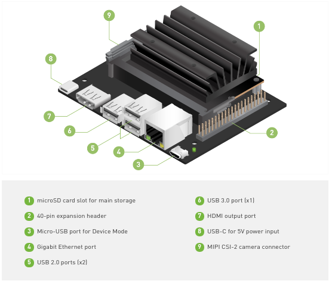

# I am A.I

# Iniciación en la I.A.

## Componentes
- NVIDIA JETSON NANO 2GB Developer Kit with WIRELESS USB Adapter.
- Tarjeta Memoria Micro SD 64GB.
  - microSD Card (UHS-1 32 GB minimum)
  - 64 GB or more recommended
  - High endurance card recommended
- USB keyboard and mouse
- HDMI display
- USB-C power supply (5V⎓3A).
- 802.11ac wireless adapter and extension cable.
- Compatible webcam camera such as: 
  - Logitech C270 Webcam (USB webcam camera)
  - Raspberry Pi V2 Camera

## Puesta en marcha

1. Nos bajamos la imagen del firmware `Jetson Nano 2GB Developer Kit SD Card Image` de 6GB.

        <https://developer.nvidia.com/jetson-nano-2gb-sd-card-image>

1. La introducimos en la memoria microSD de 64GB con por ejemplo Etcher desde un ordenador.

        <https://www.balena.io/etcher/>

1. Conectamos la memoria microSD a la placa Jetson Nano, conectamos la alimentación, el teclado y el Monitor HDMI.

  - La tarjeta microSD se tiene que conectar al puerto microSD de la Jetson con los pines metálicos de la tarjeta microSD mirando hacia arriba.
  
  

1. Realizamos el proceso de instalación de la imagen Ubuntu, creando nuestro usuario para acceder a la Jetson.

1. Actualizamos la distribución.

        apt update & apt upgrade

1. Conectamos nuestra webcam a la Jetson.

- Mirar video de como conectar las Rasberry PI Camera V2 al conector `MPI CSI-2 camera`.

1. Creamos el directorio donde compartiremos los datos con la imagen docker del JupyterLab Server.

        mkdir -p ~/nvdli-data

1. Arrancamos el JupyterLab Server dockerizado:

- Si tenemos la camara USB Camera, ejecutaremos los siguientes comandos.

      echo "sudo docker run --runtime nvidia -it --rm --network host \
          --volume ~/nvdli-data:/nvdli-nano/data \
          --device /dev/video0 \
          nvcr.io/nvidia/dli/dli-nano-ai:v2.0.1-r32.4.4" > docker_dli_run.sh
      chmod +x docker_dli_run.sh
      ./docker_dli_run.sh

- Si usamos la camara CSI, ejecutaremos los siguientes comandos.

      echo "sudo docker run --runtime nvidia -it --rm --network host \
            --volume ~/nvdli-data:/nvdli-nano/data \
            --volume /tmp/argus_socket:/tmp/argus_socket \
            --device /dev/video0\
            nvcr.io/nvidia/dli/dli-nano-ai:v2.0.1-r32.4.4" > docker_dli_run.sh
      chmod +x docker_dli_run.sh
      ./docker_dli_run.sh

Este proceso puede tardar un rato, ya que se tiene que bajar las imagenes.

1.  Una vez docker ha arrancado tenemos el servicio JupyterLab Server en el puerto 8888. Nos aparecera un mensaje parecido al siguiente:

> Logging Into The JupyterLab Server
> browser: 192.168.55.1:8888
> dlinano

1. Ahora podremos acceder desde nuestro portatil al Servidor JupyterLab usando un navegador web. Por ejemplo:

        http://192.168.55.1:8888/  
   

## URLs Referencia:
- [Getting Started with Jetson Nano 2GB Developer Kit](https://developer.nvidia.com/embedded/learn/get-started-jetson-nano-2gb-devkit)
- [Welcome to Getting Started with AI on Jetson Nano!](https://courses.nvidia.com/courses/course-v1:DLI+S-RX-02+V2/)
- [Raspberry Pi Camera Connection Demonstration](https://dli-lms.s3.amazonaws.com/data/c-rx-02/videos/3_Camera-insertion.mp4)
